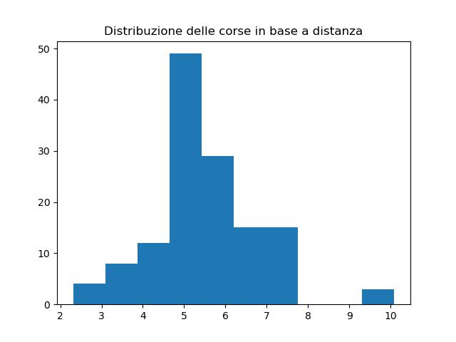
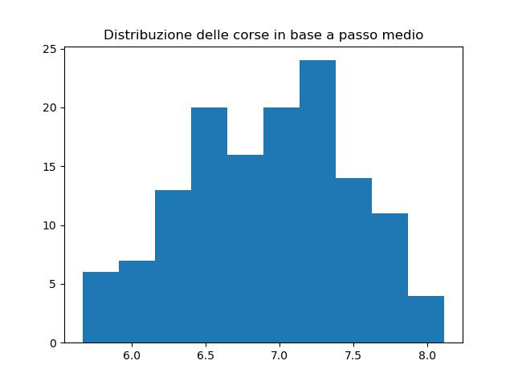
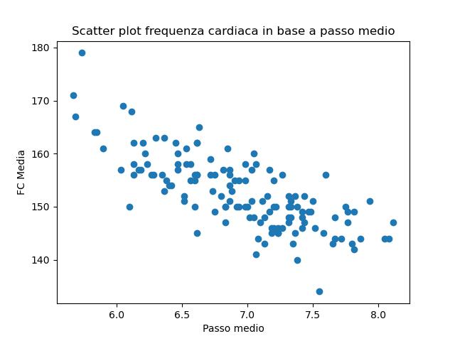
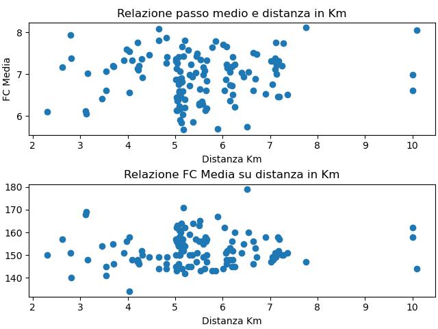
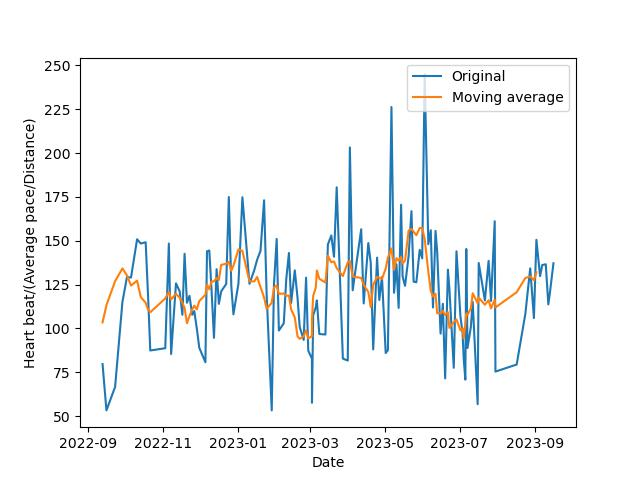

# corse_sett-sett_23
One year run statistics, trying to figure out if my performance is getting better..
No big results unfortunately..;)

## Main stats
* Total run distance (km): 739.34
* Total runs count: 135
* Totale run time: 3 days 13:32:27
* Average heart-rate: 152.70
* Total burnt calories: 56922

## Run on distance distribution
  

## Run on average pace distribution
  

## Average heart beat and average pace scatter plot
  

## Average heart beat and average pace on distance
  

## Time evolution of average heart beat/distance
This is a last try to catch some increase in performance (aka reduction of average heartbeat on average pace/distance), but not big results, it seems at least.

  